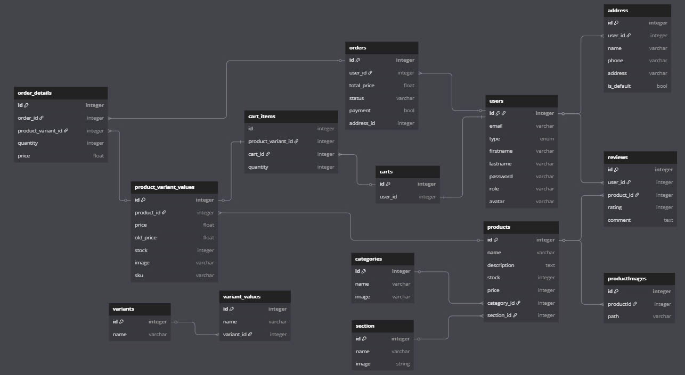

## 🛒 Shop thời trang

## 🧾 Mô tả tổng quan

Đây là hệ thống backend cho một website thương mại điện tử bao gồm các chức năng quản lý người dùng, sản phẩm, biến thể sản phẩm, giỏ hàng, đơn hàng, đánh giá và địa chỉ giao hàng. Dữ liệu được tổ chức rõ ràng theo mô hình quan hệ và hỗ trợ các thao tác như mua hàng, quản lý tồn kho, và xử lý thanh toán.

# Giao diện đăng nhập/đăng ký

# Giao diện chi tiết sản phẩm/tìm kiếm sản phẩm

# Giao diện giỏ hàng/thanh toán

# Giao diện thông tin cá nhân

# Giao diện admin

---

## 🗃️ Mô hình cơ sở dữ liệu

---

## 🔍 Các bảng chính

### 1. **Users**

- Quản lý thông tin người dùng.
- Các trường: `email`, `firstname`, `lastname`, `password`, `avatar`, `role`, `type`.

### 2. **Products**

- Thông tin sản phẩm chung.
- Có mối quan hệ 1-n với:
  - `product_variant_values`
  - `productImages`
  - `reviews`

### 3. **Product Variant Values**

- Biến thể cụ thể của sản phẩm (ví dụ: size, màu...).
- Có liên kết tới:
  - `variants` qua `variant_values`
  - `order_details` và `cart_items`

### 4. **Variants** và **Variant Values**

- Cấu trúc thuộc tính sản phẩm, ví dụ: Size (S, M, L), Color (Red, Blue).
- Cho phép tạo các biến thể phức tạp.

### 5. **Cart & Cart Items**

- Mỗi người dùng có một `cart`.
- `cart_items` liên kết đến biến thể sản phẩm.

### 6. **Orders & Order Details**

- Thông tin về đơn hàng người dùng đặt.
- `order_details` lưu chi tiết từng sản phẩm (biến thể) đã mua.

### 7. **Categories** và **Sections**

- Phân loại sản phẩm theo danh mục và chuyên mục.

### 8. **ProductImages**

- Lưu đường dẫn ảnh liên quan đến sản phẩm.

### 9. **Reviews**

- Người dùng có thể đánh giá sản phẩm đã mua.

### 10. **Address**

- Mỗi người dùng có thể có nhiều địa chỉ giao hàng.

---

## 📦 Các tính năng chính của hệ thống

- 🔐 Đăng ký / Đăng nhập người dùng, Đăng nhập với Google, Captcha khi đăng ký
- 📦 Quản lý sản phẩm & biến thể
- 🛒 Giỏ hàng và mua hàng, thanh toán khi nhận hàng, thanh toán với QRCODE
- 🧾 Quản lý đơn hàng
- 📤 Quản lý hình ảnh sản phẩm
- 🏷️ Phân loại sản phẩm theo danh mục và chuyên mục
- 🏠 Quản lý địa chỉ người dùng

---

## 🛠 Công nghệ đề xuất

- **Backend**: Node.js (Express), Sequelize ORM
- **Database**: PostgreSQL / MySQL
- **Authentication**: JWT
- **Frontend**: React.js (nếu có UI)
